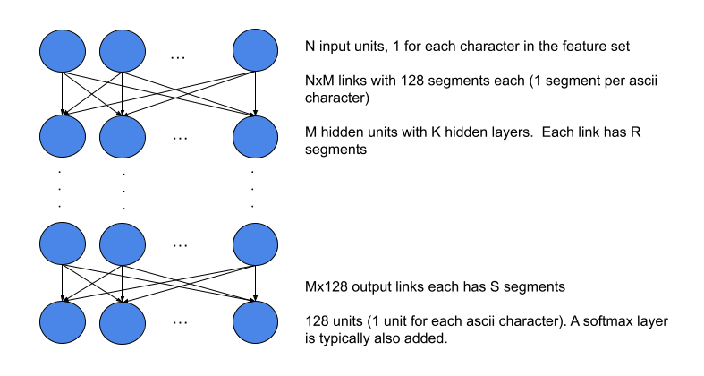

[](https://github.com/jloveric/language-interpolation/actions/workflows/python-app.yml)

# Natural Language Generation with High Order Layers
High order and piecewise networks for natural language generation (see [here](https://github.com/jloveric/high-order-layers-torch) for a description of High order layers being used).  The typical high order network design with piecewise polynomial
layers here is a fully connected network where each link has multiple segments.  Only one segment in
a link is active for each input so the network sparsity is determined by the number of segments. Although it looks like a standard MLP, the structure is more complicated and is a form of routing network with piecewise polynomials.




# Dataset

Data from project Gutenberg are used, either single or multiple books.  Training is done on the character level.  A pytorch lightning data module for project Gutenberg has been implemented for data loading.

# Language interpolation of Books
Run with nevergrad
```
python examples/high_order_interpolation.py -m data.type=sequence
```
# With conv layers (not yet working)
```
python examples/language_interpolation_conv.py data.type=sequence
```
# Run with centered model (language cellular automaton)
```
python examples/language_cellular_automata.py mlp.features=11 data.type=centered
```
## Apply a model using sequence model
```
python examples/high_order_interpolation.py train=False checkpoint=\"multirun/2021-05-16/17-27-58/2/lightning_logs/version_0/checkpoints/epoch=19-step=34199.ckpt\" topk=2 num_predict=200 text="The stars were"
```
example output (model trained to predict the next character given the preceeding 10) using a single hidden layer
```
prompt: The stars were
output: The stars were dreams of my friends and the secret of my father the expenses, in the morning when I awill a trees than sunsitice of my friends when I continued, and the deatures, and the destruction of distance of 
```
The model attempts to memorize the entire book (Frankenstein) by predicting the next character. Each character is provided as a probability by the network.  By choosing (weighted by probability) between the top 2 next characters you produce text (so far nonsense) that changes every time the function is called.  This is fairly standard, but we deliberately memorize the training set, there is no test set.

# As cellular automaton
A centered model can be repeatedly applied to the same text as a moving window and will work with arbitrary length sentences.  This
approach is similar to stencils used in solving partial differential equations.
```
python examples/language_cellular_automata.py mlp.features=11 data.type=centered train=False checkpoint=\"outputs/2021-08-21/20-14-40/lightning_logs/version_0/checkpoints/epoch=20-step=35909.ckpt\" topk=2 num_predict=200 text="The monster awakes" topk=1 data.reapply=10
```